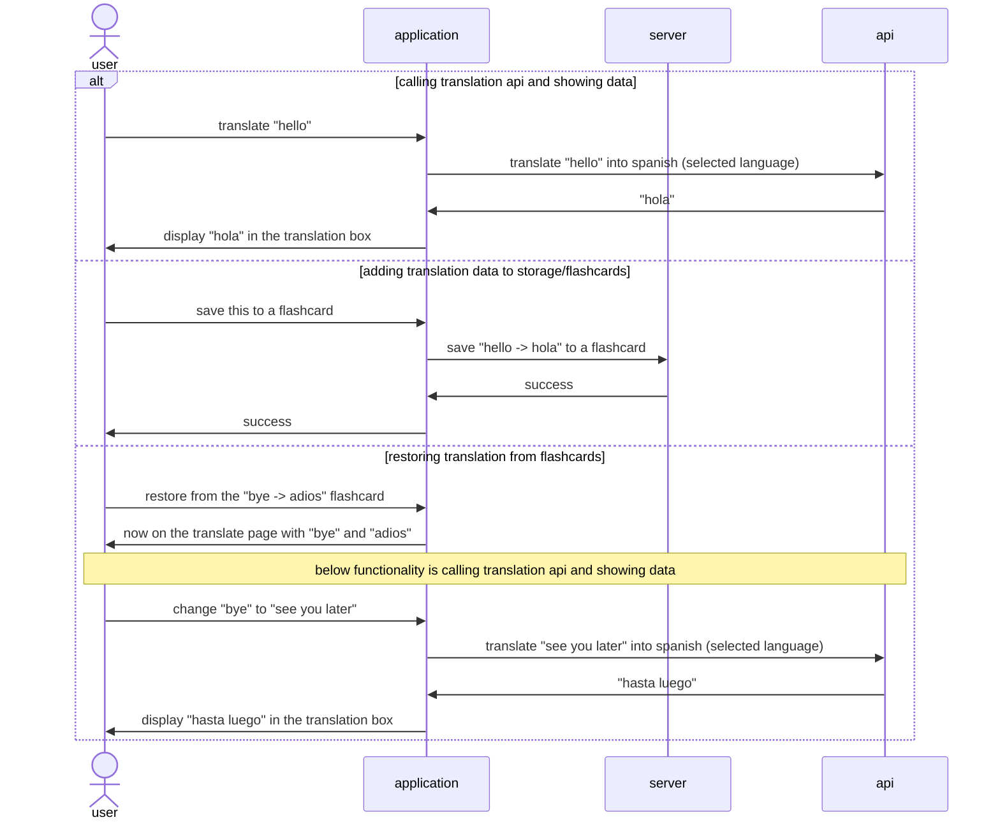

# Feature: translation page

- calling translation api and placing data on page (5 pts)
- add translation data to storage/flashcards (3 pts)
- restoring translations from flashcards (3 pts)

## Feature descriptions

### Calling translation API and showing data

As a user is typing or upon request, the application will call a translation api and display the translation in another section of the window. The translation language will be decided with the language switching feature.

### Add translation data to storage/flashcards

Once a translation is done, users will have the option to save the data to a remote(temporarily fake/local) database and have it appear in their flashcards.

### Restoring translation from flashcards

Users will be able to restore the text from flashcards in case they want to modify the content of a flashcard while seeing the translation or see what effect changing flashcard contents will have on a translation.

## Mermaid diagram for ???

