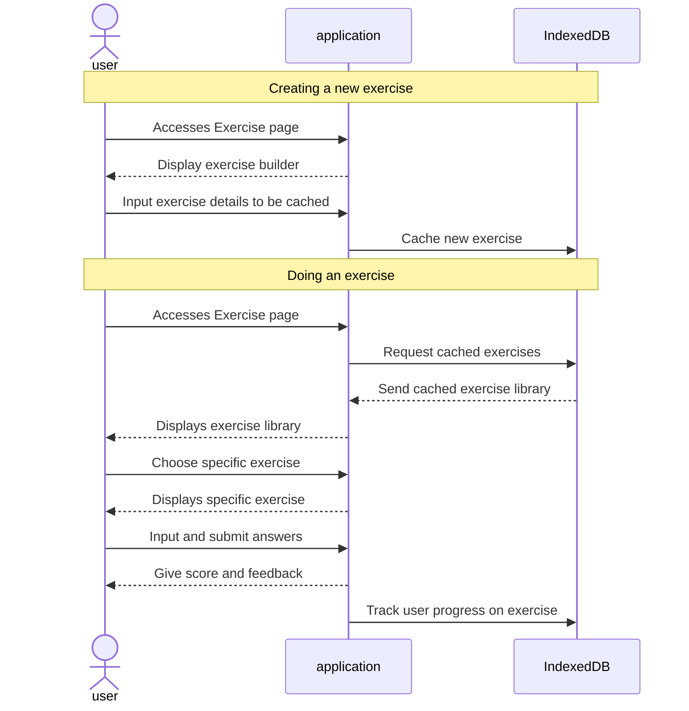

# Feature: exercise page

- design exercise structure (3 points)
- exercise builder (3 points)
- make user interface (2 points)
- implement scoring and feedback (1 point)
- track user progress (1 point)

## Feature descriptions

### Design exercise structure

To provide a diverse and engaging learning experience, the app will support multiple exercise types, including:
- Multiple Choice: Users select the correct answer from a list of options.
- Fill in the Blank: Users type the missing word or phrase in a sentence or paragraph.
- Matching: Users connect pairs of related items (e.g., words and their translations).
- Listening Comprehension: Users listen to audio clips and answer questions based on the content.
Each exercise will be defined by a JSON-like structure with attributes such as exercise type, prompt, correct answers, incorrect answers, hints, and feedback.

### Exercise builder

Develop a user-friendly interface that allows users to create their own language learning exercises. This feature should include:
- Exercise Type Selection: Provide options for various exercise types.
- Prompt and Response Input: Enable users to input the prompt or question for the exercise, as well as the correct and incorrect answers.
- Hint and Feedback Customization: Provide the option to add hints and specific feedback messages for correct and incorrect answers.
- Exercise Preview and Editing: Offer a preview function to visualize the created exercise and make necessary adjustments before saving.
- Exercise Library Management: Allow users to organize and categorize their created exercises into a personal library.

### Make user interface 

For an engage user experience, the interface should have an intuitive layout and clearly display the different exercise types. The input fields of each exercise should match each exercise type. Styling like typography and overall design language should match the rest of the web application.

### Implement scoring and feedback

Feedback should be displayed when an exercise is answered correctly or incorrectly.

### Track user progress 

When an exercise is answered, it should be scored and this attempt will be stored per user to track exercise progress over time.

