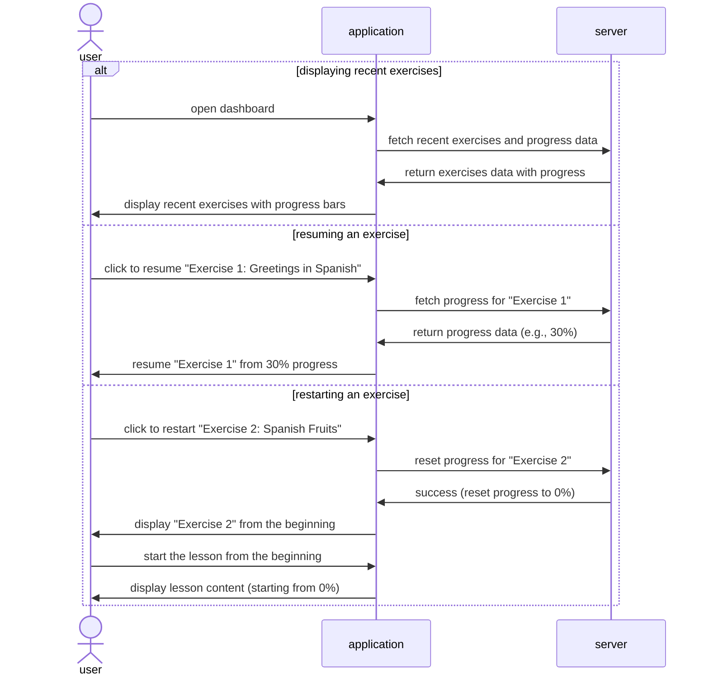

# Feature: Dashboard
- fetching and displaying recent exercises (3 pts)
- fetching stored progress generating progress bar (3 pts)
- continuing an exercise from stored state (2 pts)
- restarting an exercise from the beginning(2 pts)

## Feature Descriptions

### Fetching and displaying recent exercises
Once a user logs in, it will display a few recent exercises that the user worked on the previous times that they visited the application. 

### Fetching and generating progress bar
Under the name of each exercise, there will be a progress bar, colored in to visualize how much of the exercise the user has completed. 

### Continuing an exercise from stored state
The user can choose to continue an exercise directly from the dashboard. This takes them to the lesson and allows them to complete the exercise from where they left off. 

### Restarting an exercise from the beginning
If a user is not confident with recent material and wants to restart an exercise, they are also able to do that directly from the dashboard. This takes them to the exercise, restarts it, and updates the progress to 0%.

## Mermaid Diagram for Recent Exercises 

